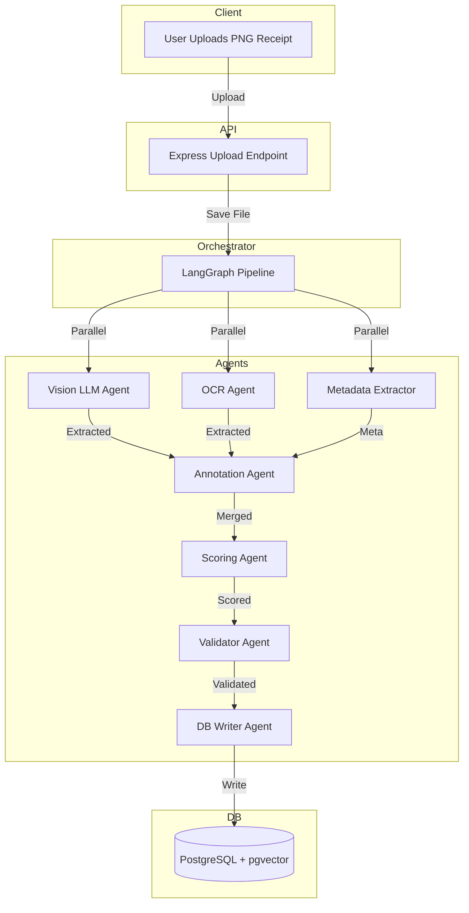

# Receipt Ingestion Pipeline

This project implements an end-to-end intelligent system for processing receipt images, extracting structured data using AI models, storing the data in PostgreSQL, and enabling advanced querying and analytics (SQL + RAG).


## Revised Architecture & Modular Design



## Pipeline Flow

1. **Upload**: User uploads PNG receipt (client-side action)
2. **Preprocess**: File is saved by API
3. **Parallel Extraction**: Vision LLM, OCR, Metadata agents run in parallel
4. **Annotation**: Results merged (prefer vision, fallback to OCR, attach meta)
5. **Scoring**: Confidence assigned (sources, completeness)
6. **Validation**: Structure, permissions, and retry if needed
7. **DB Write**: Data stored in PostgreSQL (with pgvector for embeddings)

## Modular Skills & Agents

- **Skills**: Each agent/skill is modular and registered in `skillsRegistry.js` (semantic RAG, SQL RAG, hybrid RAG, embedding, similarity, SQL writer, graph traversal, proxy index, multi-anchor SQL, ingest SQL to RAG)
- **State**: State includes user query, extracted fields, merged/annotated data, scores, metadata, generated SQL, execution results, and all relevant skills used
- **Executor**: DB Writer Agent is the executor, modular and decoupled from orchestrator
- **Buffer Memory & Caching**: Buffer memory for recent context, caching for repeated queries/results, with cleaning and management
- **Validation & Retry**: Validation agent checks outputs; retry mechanism on failure
- **JWT & Permissions**: JWT and permission checks as middleware, enforced at orchestrator and agent level
- **Agent Roles**: Prompts and logic define read/write roles, enforced in system
- **Analytics & Statistics**: All results and scores are kept for analytics/statistics
- **Extensibility**: Plug in new skills/agents as needed; generic skills defined in a separate file and referenced

## Receipt Extraction Output Schema (JSON)

```json
{
  "date": "2024-03-25",
  "total": 42.50,
  "category": "food",
  "items": [
	{"name": "item1", "price": 10.00},
	{"name": "item2", "price": 32.50}
  ],
  "meta": {"resolution": "300dpi", "filetype": "png", ...}
}
```

## Hybrid RAG: SQL & Semantic

- **SQL RAG**: Generates and executes SQL queries for structured data (standalone or hybrid)
- **Semantic RAG**: Embeds queries and retrieves via vector search (pgvector)
- **Hybrid**: Combines both for best results; cross-encoder reranking for advanced ranking

## Docker Compose

- Multi-container: PostgreSQL (with pgvector), pgAdmin, app server, (optionally) separate containers for agents
- See `docker-compose.yml` for setup

## Best Practices & Recommendations

- Modularize DB connection and execution logic
- Use buffer memory and caching with management
- Validation and retry for image-to-text and SQL
- JWT and permission checks as middleware
- Define agent roles and permissions in prompts and logic
- Reference skills in state and prompts
- Keep generic skills in a separate file
- All results, scores, and analytics are kept for statistics

---
This README reflects all 27 architectural, modularity, and best practice points for a robust, scalable, and analyzable receipt ingestion and RAG pipeline.

## System Prompt Annotations

All agents and skills in this pipeline are annotated with system prompts specifying:
- **Rules**: What the agent/skill must and must not do
- **Tools**: APIs or utilities available
- **Few-shot**: Example Q&A for expected behavior
- **Chain-of-thought**: Step-by-step reasoning
- **Skills**: (if applicable) Skills or agents to call

## Example (Vision LLM Agent)

```
You are the Vision LLM Agent.
Rules:
- Only extract structured data from receipt images.
- Never hallucinate values.
Tools:
- Vision LLM API
Few-shot:
Q: [receipt image with date, total, category]
A: { "date": "2024-03-25", "total": 42.50, "category": "food" }
Chain-of-thought:
- Analyze image
- Extract fields
- Output JSON
Skills:
- Use annotation and scoring skills for post-processing
- Use guard agent for permission checks if needed
```

See each agent/skill file for its full system prompt annotation.

## Usage

- POST `/api/receipts/upload` with a PNG file (field name: `file`)
- Returns the stored receipt record

## Extensibility
- Plug in real Vision LLM/OCR APIs in `agents/`
- Add RAG/semantic querying via a new agent and endpoint
- Integrate with LangChain/LangGraph for advanced orchestration
